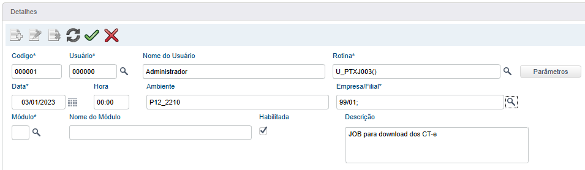

# 👾Configurando os Jobs

Os Jobs são responsáveis pela automatização dos processos na ferramenta, como por exemplo, buscar as chaves e os seus respectivos XML diretamente do SEFAZ e também outros processos como workflows e CheckDoc.

Existem duas opções para configuração dos jobs, sendo via ONSTART no appserver.ini (**recomendado**) ou via Schedule do ERP.

## Via OnStart no AppServer.ini

Nesse modo os JOBs serão executados diretamente no appserver em questão e em intervalos de acordo com um prazo configurado (não é possível configurar o número de execuções e nem o horário exato da execução igual no Schedule).

Para um melhor resultar e evitar conflitos de processamento, recomendamos criar dois appservers exclusivos para execução desses Jobs, sendo:

- **Appserver_Facile_Xml01:** Responsável pelo download dos documentos

- **Appserver_Facile_Xml02:** Responsável pela revalidação dos documentos

Obs.: Os nomes das pastas do appserver aqui mencionados são apenas sugestões, fique a vontade para altera-los.

Vamos configurar:

### Appserver_Facile_Xml01

Crie um novo appserver baseado no appserver de produção e renomeie para "appserver_facile_xml01".


Entre na pasta criada e altere o arquivo appserver.ini configurando RPO exclusivo para esse serviço e no final do arquivo configure os JOBs conforme abaixo:

```ini
;;Job Responsável por baixar as NF-e no Sefaz
[PTXJ001]
MAIN=U_PTXJ001
ENVIRONMENT=PRODUCAO
nparms=2
Parm1=01
Parm2=0101

;;Job responsável por realizar o download do CT-e no Sefaz
[PTXJ003]
MAIN=U_PTXJ003
ENVIRONMENT=PRODUCAO
nparms=2
Parm1=01
Parm2=0101

;;Tag responsável por inicializar e controlar os jobs
[ONSTART]
JOBS=PTXJ001,PTXJ003
REFRESHRATE=4000
```

#### Explicando as TAGs

> MAIN                    => Nome do programa ser chamado
> 
> ENVIRONMENT  => Ambiente que o JOB será execuado
> 
> nparms                => Quantidade de parâmetros a serem utilizados
> 
> Parm1                  => Informe o código da empresa (igual ao cEmpAnt)
> 
> Parm2                  => Informe o código da primeira filial (igual ao cFilAnt)
> 
> REFRESHRATE    => Intervalo de tempo (em segundos) para que execução do JOB

Basta salvar o appserver.ini com essas alterações.

### Appserver_Facile_Xml02

Crie um novo appserver baseado no appserver de produção e renomeie para "appserver_facile_xml02".


Entre na pasta criada e altere o arquivo appserver.ini configurando RPO exclusivo para esse serviço e no final do arquivo configure os JOBs conforme abaixo:

```ini
;;Job Responsável por revalidar os documentos no Sefaz
[PTXJ004]
MAIN=U_PTXJ004
ENVIRONMENT=PRODUCAO
nparms=2
Parm1=01
Parm2=0101

;;Tag responsável por inicializar e controlar os jobs
[ONSTART]
JOBS=PTXJ004
REFRESHRATE=4000
```

#### Explicando as TAGs

> MAIN                    => Nome do programa ser chamado
> 
> ENVIRONMENT => Ambiente que o JOB será execuado
> 
> nparms                => Quantidade de parâmetros a serem utilizados
> 
> Parm1                  => Informe o código da empresa (igual ao cEmpAnt)
> 
> Parm2                  => Informe o código da primeira filial (igual ao cFilAnt)
> 
> REFRESHRATE    => Intervalo de tempo (em segundos) para que execução do JOB

Basta salvar o appserver.ini com essas alterações.

## Via Schedule do ERP

Acesse o ambiente Configurador (SIGACFG)

*Ambiente > Schedule > Schedule*

**Obs**.: O serviço de schedule e seu Agent já deve estar configurados e funcionando, segue documentação oficial:

[Schedule - Como agendar a execução de rotinas - Frameworksp - TDN](https://tdn.totvs.com/pages/releaseview.action?pageId=271167961)

Acesse a visão "Schedule > Agendamentos > Cadastro"


### PTXJ001 - Baixa de NF-e

Deve ser configurado um agendamento do PTXJ001 para cada grupo de empresas e selecionar apenas a primeira filial.

**Exemplo:**

<u>Empresa 01 e possui as filiais 0101, 0102 e 0103</u>

<u>O campo "Empresa/Filial" ficará: 01/0101;</u>

Realize o cadastro do primeiro JOB seguindo o exemplo abaixo:


*Lembre-se de alterar o "Ambiente" e "Empresa/Filial" conforme o seu cenário.*

Antes de confimar o cadastro, vamos configurar a recorrência do JOB (clicando no botão parecido com: 🔄️).

Na tela de recorrência:


**Obs.:** O SEFAZ por padrão bloqueio consultas repetidas em menos de 1 hora de intervalo.

Agora sim podemos confirmar a tela de recorrência e a tela de cadastro do agendamento ✔️.

### PTXJ003 - Baixa de CT-e

Deve ser configurado um agendamento do PTXJ003 para cada grupo de empresas e selecionar apenas a primeira filial.

**Exemplo:**

<u>Empresa 01 e possui as filiais 0101, 0102 e 0103</u>

<u>O campo "Empresa/Filial" ficará: 01/0101;</u>

Realize o cadastro do segundo JOB seguindo o exemplo abaixo:



*Lembre-se de alterar o "Ambiente" e "Empresa/Filial" conforme o seu cenário.*

Antes de confimar o cadastro, vamos configurar a recorrência do JOB (clicando no botão parecido com: 🔄️).

Na tela de recorrência:


**Obs.:** O SEFAZ por padrão bloqueio consultas repetidas em menos de 1 hora de intervalo.

Agora sim podemos confirmar a tela de recorrência e a tela de cadastro do agendamento ✔️.

### PTXJ004 - Revalidação de NF-e e CT-e

Deve ser configurado um agendamento do PTXJ003 para cada grupo de empresas e selecionar apenas a primeira filial.

**Exemplo:**

<u>Empresa 01 e possui as filiais 0101, 0102 e 0103</u>

<u>O campo "Empresa/Filial" ficará: 01/0101;</u>

Realize o cadastro do terceiro JOB seguindo o exemplo abaixo:


*Lembre-se de alterar o "Ambiente" e "Empresa/Filial" conforme o seu cenário.*

Antes de confimar o cadastro, vamos configurar a recorrência do JOB (clicando no botão parecido com: 🔄️).

Na tela de recorrência:


**Obs.:** O SEFAZ por padrão bloqueio consultas repetidas em menos de 1 hora de intervalo.

Agora sim podemos confirmar a tela de recorrência e a tela de cadastro do agendamento ✔️.

## RPO do JOB

O RPO do ambiente que executa os JOBs precisa estar com o patch da ferramenta aplicado e recomendamos que não seja compartilhado com outros ambientes. No caso do Schedule, irá utilizar o próprio RPO do ambiente Schedule e também necessita do patch aplicado.

**Obs**.: Os appserver.ini criados deverão apontar para esse RPO com o patch aplicado.

## Parâmetros de autenticação

Deverá ser configurado os parâmetros abaixo com as credenciais fornecidas pela Facile Sistemas:

### ZZ_AUTHLOG

Descrição: Usuário para autenticação na Facile Sistemas

### ZZ_AUTHPSW

Descrição: Senha para autenticação na Facile Sistemas


**Ainda não tem as credenciais?** 

Basta enviar um e-mail para: [xmle@facilesistemas.com.br](mailto:xmle@facilesistemas.com.br)
