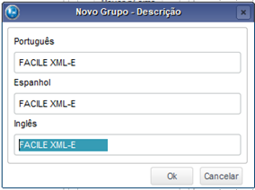
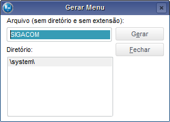

# 🎯Criando os Menus

No menu teremos as principais rotinas da ferramenta, com isso basta seguirmos a criação abaixo:

Acesse o ambiente Configurador (SIGACFG) 

*Ambiente > Cadastros > Menus*

Selecione o menu desejado, no nosso exemplo será o Compras, e clique no botão **“OK”**

No quadro da esquerda, clique no primeiro nível da árvore **“Compras”** e clique no botão **“Adicionar >>”** para que o menu seja enviado para o quadro da direita.

## Grupo de Menus

No quadro da direita, clique na pasta **“&Atualizações”** e depois clique no botão **“Novo Grupo”**.

Na tela que abrir digite: **“FACILE XML-e”** nos três campos, com isso teremos criado o grupo de menu da ferramenta.

## PTX0001 - Central XML-e

Agora vamos criar os itens desse grupo de menu, conforme passos abaixo:

Primeiramente clique na pasta criada **“FACILE XML-e”**, com isso informamos que os itens serão criados dentro desse grupo de menus.

Clique no botão **“Novo Item”** e preencha as Descrições: **“Central XML-e”**, Programa: **“PTX0001**” e configure conforme a imagem abaixo, em seguida clique em **“OK”** para salvar:

## PTX0017 - XML-e a Vista

Vamos para o próximo item de menu:

Clique no botão “Novo Item” e preencha as Descrições: **“XML-e a Vista”**, Programa: **“PTX0017”** e configure conforme a imagem abaixo, em seguida clique em **“OK”** para salvar:

## PTX0030 - Produto x Fornecedor

Vamos para o próximo item de menu:

Clique no botão **“Novo Item”** e preencha as Descrições: **“Prod. X Fornecedor”**, Programa: **“PTX0030”** e configure conforme a imagem abaixo, em seguida clique em **“OK” **para salvar:

## Finalizando o Menu

Para finalizar, vamos salvar o nosso menu para que já possa ser utilizado no módulo de Compras.

Clique no botão **“Gerar”** e na janela que abrir preencha conforme a imagem abaixo e clique no botão **“Gerar”** dessa nova janela.

Confirme a geração do menu e informe que deseja substituir o atual.

Com isso finalizamos o Menu e a instalação da ferramenta FACILE XML-e!!
