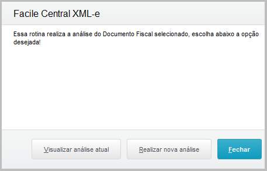
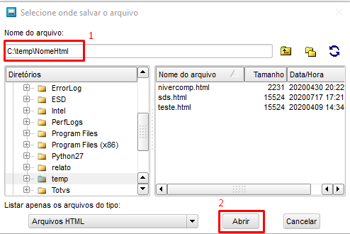

# Checkdoc

## Introdução

O objetivo do CheckDoc é realizar uma análise do XML recebido do Sefaz e verificar no ERP Protheus se as informações contidas nele estão corretas.

Será verificado:

- Dados do fornecedor
- Dados dos produtos
- Dados dos pedidos de compra

## Como usar?

Para que um documento seja analisado pelo **CheckDoc**, basta selecioná-lo na tela principal da Central XML-e e chamar a ferramenta conforme demonstrado na imagem abaixo:

Caminho: **Central XML-e/Outras Ações/CheckDoc**

 Figura 1: Checkdoc no "Outras ações 

Será apresentado a imagem abaixo com as opções “Visualizar análise atual”, “Realizar nova análise” e “Fechar”.

 Figura 2: Realiza a análise do Documento Fiscal 

A opção **“Visualizar análise atual”** irá demonstrar o resultado da última análise do CheckDoc nesse documento e a opção **“Realizar nova análise”** irá executar todas as verificações novamente e gerar um novo resultado.

Ao selecionar a opção de realizar nova análise, basta aguardar o processamento terminar e você já poderá visualizar o resultado da análise.

 Figura 3: Visualizar resultado da análise 

Clicando em “SIM”, será solicitado a pasta onde o relatório em HTML será salvo e em seguida já o abrirá automaticamente.

 Figura 4: Salvar relatório 

O cabeçalho do relatório demonstra os principais dados do documento, como número, série, valor, natureza da operação etc.

 Figura 5: Cabeçalho relatório 

## Fornecedor

No setor “**Fornecedor**” será realizado a análise das informações do fornecedor que está no Protheus e as informações que estão no XML.

 Figura 6: Comparação dos dados do Fornecedor 

São geradas duas linhas, sendo a primeira com os dados do XML e a segunda com os dados encontrados no Protheus (isso se o fornecedor estiver cadastrado no Protheus).

As colunas com inconsistência nas informações são destacadas em vermelho para melhor identificação.

É possível configurar quais colunas que deseja auditar conforme abaixo:

Criar um parâmetro com o nome ZZ\_FORNC1 do tipo lógico, então se o conteúdo dele for .T. a coluna será auditada.

O número no final do parâmetro ZZ\_FORNC**1** corresponde a posição da coluna em questão, contando da esquerda para a direita, portando se quiser auditar a coluna CNPJ/CPF, por exemplo, deverá ativar o parâmetro ZZ\_FORNC4.

### Validações do fornecedor

- ZZ\_FORNC1  - Origem (XML e ERP)

- ZZ\_FORNC2  - Valida a razão social

- ZZ\_FORNC3  - Valida o nome fantasia

- ZZ\_FORNC4  - Valida o CNPJ

- ZZ\_FORNC5  - Valida a inscrição estadual

- ZZ\_FORNC6  - Valida o bairro

- ZZ\_FORNC7  - Valida o código município

- ZZ\_FORNC8  - Valida o Município

- ZZ\_FORNC9  - Valida a UF

- ZZ\_FORNC10 - Valida o CEP

## Produtos

No setor “**Produtos**” será realizado a análise das informações do produto e pedido de compra que está no Protheus e as informações que estão no XML.

 Figura 7: Comparação dos dados dos Produtos 

São geradas duas linhas para cada item do XML, sendo a primeira com os dados do XML e a segunda com os dados encontrados no Protheus (isso se o fornecedor enviar os dados do pedido de compra nas tags corretas ou pelo menos já existir a amarração Produto x Fornecedor).

As colunas com inconsistência nas informações são destacadas em vermelho para melhor identificação.

É possível configurar quais colunas que deseja auditar conforme abaixo:

Criar um parâmetro com o nome ZZ\_PRODC1 do tipo lógico, então se o conteúdo dele for .T. a coluna será auditada.

O número no final do parâmetro ZZ\_PRODC**1** corresponde a posição da coluna em questão, contando da esquerda para a direita, portando se quiser auditar a coluna “**Numero PC**”, por exemplo, deverá ativar o parâmetro ZZ\_PRODC6.

### Validações dos produtos

- ZZ\_PRODC1   - Valida o total de itens no xml

- ZZ\_PRODC3   - Valida se o código do produto

- ZZ\_PRODC4   - Valida a descrição do produto 

- ZZ\_PRODC5   - Valida o NCM do produto 

- ZZ\_PRODC6   - Valida se o número do pedido de compra está igual ao do XML

- ZZ\_PRODC7   - Valida se o número da ordem dos itens 001,002,...

- ZZ\_PRODC8   - Valida a quantidade

- ZZ\_PRODC9   - Valida o preço unitário

- ZZ\_PRODC10  - Valida o preço total do item 

- ZZ\_PRODC11  - Valida a unidade de medida

- ZZ\_PRODC12  - Valida o tipo do frete CIF ou FOB

**-FIM-**
