

# Manual do Usuário

## Introdução

O FACILE XML-e é uma ferramenta desenvolvida no ERP Protheus visando controle e agilidade nos processos de Entrada de Nota Fiscal Eletrônica e Conferência de Impostos.

A ferramenta possui uma rotina que trabalha de maneira automática e transparente monitorando no SEFAZ os documentos fiscais emitidos pelos fornecedores e disponibilizando diversas funcionalidades como Manifestação do Destinatário, Importação do XML, Relatórios, Confronto de Impostos calculados pelo ERP Protheus versus Impostos do XML, entre outros.

## A Ferramenta

Para acessá-la, entre no módulo SIGACOM, no meu principal, clique em *atualizações* e acesse a *Facile XML-e*, como descrito na Figura 1.

 Figura 1: Menu principal 

A **Central XML-e** auxilia no processo de geração de documentos de entrada.

A **Gestão à Vista** auxilia no gerenciamento dos documentos.

## FACILE Central XML-e

A Figura 2 mostra a tela principal que é a Central XML-e.

Nela é possível realizar as seguintes ações: Cadastrar Fornecedor, Imprimir Danfe/Dacte, Gerar Entrada, acessar Outras Ações e pesquisar.

 Figura 2: Tela Central XML-e 

### Cadastrar Fornecedor 

Ao cliente no botão **+Cad. Fornecedor**, da figura 3 abaixo:

 Figura 3: Botão Cad. Fornecedor 

Ao selecionar o XML desejado e clicar em +Cad. Fornecedor, poderá ter uma mensagem de Fornecedor já cadastrado, caso o mesmo já se encontre na base de dados do Protheus (SA2). Se isso ocorrer será apresentado a figura 4 abaixo:

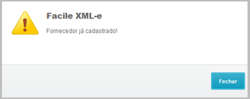
 Figura 4: Fornecedor encontrado na SA2 

Caso contrário, irá abrir o cadastro padrão de Fornecedor no ERP Protheus (SA2) conforme a figura 5 abaixo:

 Figura 5: Incluindo Fornecedor na SA2 

### Imprimir Documento

Nessa opção, basta selecionar o XML desejado para imprimir a DANFE ou DACTE correspondente. 

* **Imprimir DANFE/DACTE:** ao selecionar um registro e clicar nessa opção, o sistema irá solicitar as configurações necessárias para imprimir a DANFE, assim como descrito na Figura 6.

 Figura 6: Configurações de Impressão 

### Gerar Entrada (Início do processo diário)

Para gerar uma entrada, selecione uma NF e clique no botão *Gerar Entrada*, como mostra a Figura 7 abaixo:

 Figura 7: Tela principal com foco no botão Gerar Entrada 

Se não houver um XML baixado para aquela NF, então o sistema se conectará com o SEFAZ e realizará o download.

 Figura 8: Conexão com o SEFAZ 

Após isso, o sistema irá apresentar uma tela para definição do Tipo de Nota que está sendo realizado a entrada, sendo o padrão “Normal”. Conforme a figura 9 abaixo:

 Figura 9: Tipos de Notas 

Caso a Nota Fiscal tenha alguma **Carta de Correção** atrelada, será apresentado logo na abertura.

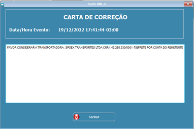
 Figura 9.1: Carta de Correção 

Após isso, o sistema irá redirecionar para a tela “GERAR ENTRADA”, como exemplificado na Figura 10. A tela é dividida em três sub menus, são eles: cabeçalho, itens e Pré-Nota.

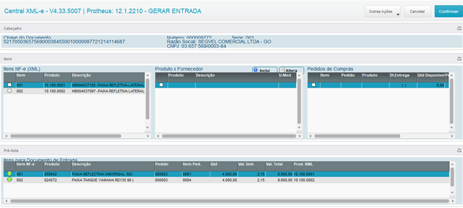
 Figura 10: Tela de Gerar Entrada 

A Figura 11 mostra os Itens, que são divididos em três grupos, sendo eles: itens NF-e (XML), Produto X Fornecedor e Pedidos de Compra.

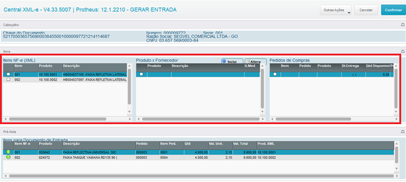
 Figura 11: Sub menu Itens 

No grupo Itens NF-e (XML), é listado todos os produtos relacionados àquela NF. Deve-se selecionar cada item com um duplo click para que o sistema mostre a amarração ProdutoxFornecedor.

 Figura 12: Tela Itens NF-e (XML) 

Ao selecionar um produto, no grupo Produto x Fornecedor será mostrado o produto equivalente ao que foi selecionado (Figura 13). 

 Figura 13: Relação Produto x Fornecedor 

Se não houver um produto equivalente, será necessário inserir clicando no ícone **+ Inclui**, ao lado do nome *Produto X Fornecedor* (Figura 14).

 Figura 14: Botão de relacionar itens 

Será aberta uma janela de busca onde mostrará os produtos disponíveis, assim como na Figura 15 abaixo:

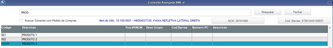
 Figura 15: Produtos Disponíveis 

Obs. Também pode ser filtrado pelo próprio NCM do produto no XML (Figura 16: Botão NCN do XML),

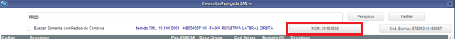
 Figura 16: Botão NCN do XML 

Caso exista um Pedido de Compras, basta marcar o Checkbox “Buscar Somente com Pedido de Compras (Figura 17).

 Figura 17: Buscar Somente com Pedido de Compras 

No grupo Pedidos de Compra, serão listados os pedidos relacionados aqueles produtos, se houver (Figura 18).

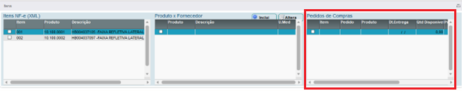
 Figura 18: Tela de Pedidos de Compra 

A Figura 19, mostra uma Pré-Nota com os produtos selecionados no subgrupo Itens. Se o produto tiver sido selecionado, então ele estará com o status *Liberado*, representado pela legenda verde. Se não tiver sido selecionado, ele estará com status *Pendente*, representado pela legenda vermelha.

 Figura 19: Pré-Nota com um produto Pendente e outro Liberado 

**Atenção:** É necessário que todos os itens estejam liberados (Status Verde) para prosseguir, conforme figura 20 abaixo:

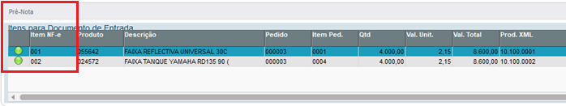
 Figura 20: Pré-Nota com todos itens Liberados 

Após essas configurações, clique no botão ***Confirmar*** e a Pré-Nota estará realizada.

 Figura 21: Confirmar criação da Pré-Nota 

Depois de terminar de processar as informações, o sistema irá redirecionar para a tela do Documento de Entrada PADRÃO (Gerar Entrada), como mostra a Figura 22.

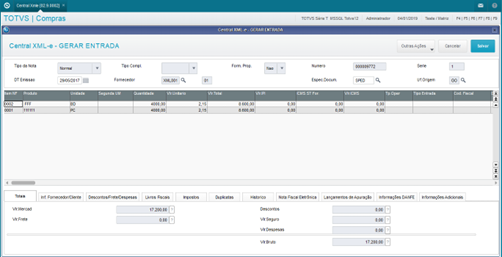
 Figura 22: Tela para gerar entrada 

Nessa tela, é necessário escolher o Tipo de Entrada para cada produto, além de preencher as informações sobre *condições de pagamento*, *descrição* e *natureza* dos produtos, na aba *Duplicatas*, como mostra a Figura 23.

 Figura 23: Aba duplicata 

Em seguida, clique no botão *salvar* e aguarde a tela de confirmação.

Caso o sistema detecte divergências entre a **TES** informada e o **XML** importado, apresentará a seguinte tela da Figura 24: Onde demonstra nas colunas 1 e 3 de acordo com o que está parametrizado na TES e nas colunas 2 e 4 como veio no XML.

 Figura 24: Confronto XML x TES 

Obs. Pode ser feita a correção manual e continuar o processo normalmente.

Caso não tenha verificado nenhuma divergência entre o TES x XML ou as mesmas tenham sidos sanadas/ignoradas, o sistema dará a opção de transmitir a manifestação de confirmação para o SEFAZ, como mostra a Figura 25.

 Figura 25: Opção de transmissão para o SEFAZ 

Ao selecionar a opção *sim*, o sistema mostrará a tela de Manifestação (Figura 26).

 Figura 26: Tela de Manifestação 

Caso seja selecionado *NÃO* (na Figura 25) ou após a manifestação, o sistema redirecionará para a tela Central XML-e com a legenda da nota criada alterada para o status “NF-e possui classificação”, representada pela cor vermelha, assim como mostra a Figura 27. 

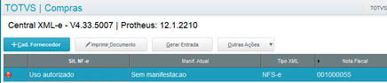
 Figura 27: Central XML-e com nota classificada 

**Dessa maneira, o processo de Documento de Entrada e Manifestação está finalizado.**

### Outras Ações

Ao selecionar Outras Ações, um menu aparecerá contendo todas as opções listadas abaixo:

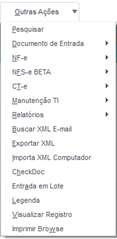
 Figura 28: Menu de Outras Ações 

* **Pesquisar:** essa funcionalidade disponibiliza uma maneira mais rápida de procurar por um registro, que pode ser feito por meio da chave NF e outros filtros padrão, como mostra a Figura 29. A Figura 30, mostra a tela de pesquisa após clicar no botão *parâmetros*, permitindo a entrada das outras informações para filtragem de acordo com o filtro selecionado.

 Figura 29: Filtros possíveis 

 Figura 30: Tela de pesquisa mostrando os parâmetros 

* **Documento de Entrada:** essa funcionalidade disponibiliza de uma maneira rápida as opções de Entrada de NF a fim de agilizar o dia a dia do usuário. A Figura 31, mostra as opções disponíveis.

    
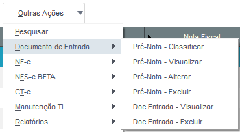
     Figura 31: Opções de Documento de Entrada 

    * **Pré-Nota - Classificar:** essa opção só estará disponível se houver uma Pré-Nota lançada e o XML constar no ERP, assim como mostra a Figura 32. É possível identificar um registro que possui Pré-Nota lançada se essa estiver com legenda amarela (Figura 33).

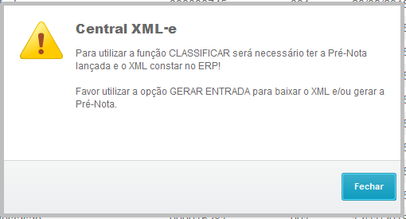
 Figura 32: Aviso sobre restrição para classificar nota 

 Figura 33: Registro com legenda amarela representando que existe uma Pré-Nota lançada 

* **NF-e:** Engloba várias funções da NF-e no mesmo submenu a fim de agilizar o dia a dia do usuário. A Figura 34, mostra as opções disponíveis.

    

     Figura 34: Opções de NF-e 

    * **Classificar NF-e:** essa opção só estará disponível se houver uma Pré-Nota lançada e o XML constar no ERP, assim como mostra a Figura 32. É possível identificar um registro que possui Pré-Nota lançada se essa estiver com legenda amarela (Figura 33).

    * **Buscar Chave Avulsa:** ao invés de sincronizar todos os documentos, o sistema permite buscar uma chave específica. A Figura 35 mostra a tela de busca.

    
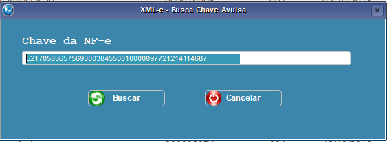
     Figura 35: Tela de busca de chave avulsa 

    * **Manifestar:** a tela de manifestação contém as seguintes partes: *Manifesto*, *Emitente* e *Nota Fiscal*, como mostra a Figura 36.

    No *Manifesto*, deverá ser inserido o tipo de manifestação que está sendo realizada, a qual está dividida em quatro opções: 

    1.	**Confirmação da Operação:** o emitente reconhece a operação e a confirma.
    2.	**Ciência da Operação:** o emitente reconhece a operação, porém ainda não está confirmada.
    3.	**Desconhecimento da Operação:** o emitente não reconhece a operação.
    4.	**Operação não Realizada:** o emitente gerou a nota, porém houve algum cancelamento e a operação não foi efetivamente realizada.

    No *Emitente*, contém as informações de quem está emitindo, assim como na *Nota Fiscal* contém as informações da nota fiscal que será manifestada.

    

     Figura 36: Tela de Manifestação 

    * **Monitorar:** essa opção serve para acompanhar a nota após a manifestação. A Figura 37 mostra um exemplo de informações necessárias para realizar o monitoramento.

    

     Figura 37: Tela de monitoramento 

    * **Manifestar em Lote:** Através dessa opção é possível realizar a manifestação de um LOTE de XML de uma única vez. A Figura 38 mostra a tela de parâmetros necessária para filtrar quais notas serão manifestadas.,
    
    

     Figura 38: Parâmetros para manifestar em lote 

Será apresentada a tela da figura 39 abaixo. Nela deve-se marcar (duplo click) quais XML irão ser manifestados, depois clicar em **Manifestar**.

 Figura 39: Manifestação em lote. 

* ** NFS-e Beta:** Rotina de importação de PDF´s de Notas Fiscais de Serviço, conforme mostra a Figura 40 abaixo:

 Figura 40: Importar PDF de NFS-e 

**Obs.** Será necessário ter o arquivo no formato PDF em uma pasta no computador.

 Figura 41: Pasta com PDF de NFS-e 

Ao selecionar a pasta onde se encontram os PDF´s, irá abrir a tela para selecionar quais serão importados. 

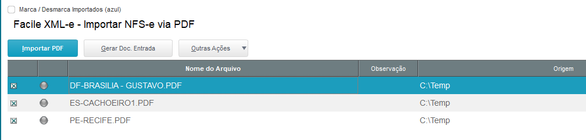
 Figura 42: Importação de NFS-e por PDF 

1. Clicar no Botão **Importar PDF** para a ferramenta analisar e importar os PDF da pasta;
2. Após os PDF terem sido importados, caso deseje, pode-se gerar a entrada de todas as NFS-e nesta mesma tela através da opção **Gerar Doc. Entrada**.

**Atenção:** Caso alguma NFS-e no formado PDF não seja importada, apresentando a mensagem “Modelo não encontrado”, ficará com status vermelho conforme imagem 43. Deve-se abrir um ticket no portal da FACILE, anexando o PDF da NFS-e em questão, solicitando homologação de município.

 Figura 43: Município não Homologado 

* **CT-e:** Neste menu estão agrupadas as funções destinadas ao CT-e, conforme mostra a Figura 44 abaixo:

    

     Figura 44: Menu de CT-e 

    * **Buscar SEFAZ:** esta opção tem por objetivo buscar no SEFAZ nos últimos 90 dias, documentos que ainda não foram baixados automaticamente. 

    

     Figura 45: Busca SEFAZ de CT-e 

    * **Consulta Status:** esta opção tem por objetivo buscar o status do CTE selecionado junto ao SEFAZ, conforme figura 46.

    

     Figura 46: Consulta Status do CT-e no SEFAZ 

    * **Manif. Desacordo:** esta opção tem por objetivo transmitir a manifestação de desacordo no SEFAZ do CTE selecionado, conforme figura 47.
    **Obs.** É necessário preencher uma observação com no mínimo 15 e no máximo 255 caracteres.

    

     Figura 47: Manifestação de Desacordo do CT-e no SEFAZ 

    * **Monitorar:** essa opção serve para acompanhar o CT-e após a manifestação.

* **Manutenção TI:** Menu destinado aos administradores do ERP Protheus de sua empresa, acesso apenas com permissão de Admin.

    

     Figura 48: Opções de Manutenção TI 

    * **Buscar Avançada SEFAZ (Somente Admin):** esta opção tem por objetivo sincronizar com a SEFAZ os documentos que ainda não sofreram manifestações do destinatário. A Figura 49 mostra a tela do sistema para essa opção.

    
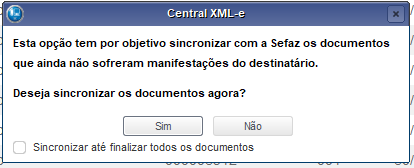
     Figura 49: Tela para sincronizar documentos 

**Obs.** O sistema é parametrizado para realizar essa busca automaticamente, assim o Botão **“Buscar Avançada SEFAZ”** serve para forçar essa busca a qualquer momento caso os serviços automáticos não estejam funcionando ou desativados.

* **Relatórios:** Nesse menu poderá extrair diretamente alguns relatórios, sem necessitar usar a rotina Gestão a Vista. São eles: XML´s não Importados e Manifestação de Destinatário.

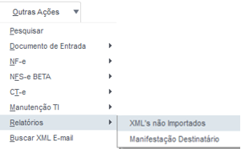
 Figura 50: Relatórios 

* **Buscar XML e-mail: (Necessário configuração prévia)** O sistema pode ser configurado para ter mais de uma opção de baixa de XML, além da automática. Para tal, é necessário solicitar seu TI que configure (em caso de dúvidas solicitar apoio a equipe FACILE) um email para receber XML. Ao clicar no Botão Buscar XML e-mail será feito uma busca e importação dos XML da conta de email configurada para dentro da Central XML-e.

 Figura 51: Buscar XML por e-mail 

* **Exportar XML:** essa opção permite exportar o XML, mas apenas dos que já estão baixados. A Figura 52 mostra a tela de exportação.

 Figura 52: Tela de Exportação XML 

* **Importar XML Computador:** Assim como a função buscar XML e-mail, outra forma de importar um arquivo XML para a Central XML-e sem ser automaticamente é a Busca direta de um diretório do computador. Ao clicar em “Importar XML Computador” será apresentado uma tela de Browser, figura 54.

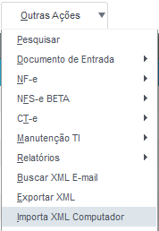
 Figura 53: Menu Importação de XML manual 

 Figura 54: Importação de XML manual 

* **Entrada em Lote:** Função criada para possibilitar a entrada em Lote de uma ou várias pré-notas, deve-se filtrar os parâmetro da figura 55, então serão apresentadas os XML disponíveis para a entrada de Pré-Nota em Lote (Figura 56).

 Figura 55: Parâmetros para a entrada de Pré-notas em lote. 

Após preencher os parâmetros, clique em OK e irá apresentar as notas disponíveis para seleção.

 Figura 56: Tela de Pré-notas em lote. 

Após selecionar as notas desejadas, clicar em Gerar Pré-Nota ou Gerar Doc. Entrada (caso queira já ir para a classificação em lote).

* **Legenda:** cada registro possui uma legenda(cor) que identifica o seu status. As legendas possíveis estão descritas na Figura 57.

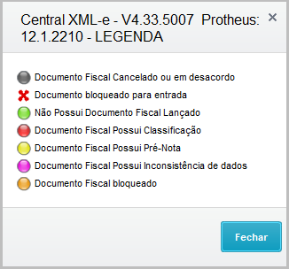
 Figura 57: Significado das legendas 

* **Imprimir Browse:** essa opção permite imprimir ou exportar para diversos formatos, toda listagem que aparece na tela Central XML-e. A Figura 58 mostra a tela de impressão/exportação.

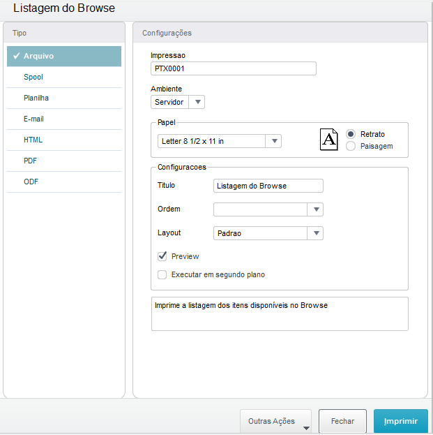
 Figura 58: Tela de Impressão/Exportação 

## Gestão à vista

Ao selecionar *Gestão à vista* no menu inicial, o sistema mostrará uma tela de filtro (Figura 59) para selecionar de que data até que data o usuário deseja que sejam realizadas as análises dos documentos.

 Figura 59: Tela de filtro Gestão à vista 

Após isso, o sistema mostra a tela principal Gestão à vista (Figura 60). Nela, é possível obter as seguintes informações sobre: 

• **Controle de Entradas:** o sistema mostra a quantidade de XML disponíveis e a quantidade sem NF de entrada, além de um gráfico para acompanhamento visual.

• **Compras Mensais:** por meio de um gráfico de barras, é possível acompanhar de forma sintética os gastos mensais com compras.

• **NF-e Cancelados:** o sistema mostra a quantidade de XML cancelados e a quantidade que foi lançada no ERP, além de um gráfico para acompanhamento visual.

• **Gestão de Fornecedores:** o sistema mostra a quantidade de fornecedores que tem XML emitido contra sua empresa e ainda não estão cadastrados no sistema.

• **NF-e Faltando XML:** o sistema mostra quantidade de Documentos de Entrada que foram incluídos no sistema sem anexar o seu XML.

• **Central XML-e:** Licença do cliente.

 Figura 60: Tela de Gestão à vista 

Caso necessite realizar outro filtro, basta clicar no botão ***Config*** 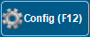 ou pressionar a tecla F12 que a tela de filtro aparecerá novamente.

Desse modo, é possível realizar o gerenciamento dos documentos em um só local.

## Check Doc

É possível utilizar a ferramenta tanto de forma automática (necessário parametrização prévia) ou manual. Aqui iremos demonstrar a forma manual.

Na Central XML-e, vá em “Outras Ações/CheckDoc”.

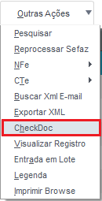
 Figura 61: Menu CheckDoc 

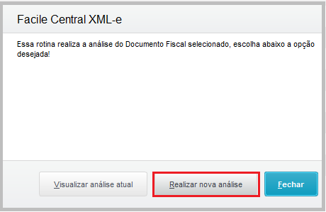
 Figura 62: CheckDoc Manual 

Clicar em Realizar nova análise.

 Figura 63: Confirmação CheckDoc 

Escolha, Sim. Selecione uma pasta para salvar o relatório.

 Figura 64: Diretório onde será saldo o arquivo de análise do CheckDoc 

Irá apresentar o relatório comparando na linha de cima o que está no XML e na de baixo no ERP Protheus.

 Figura 65: Relatório CheckDoc 

-FIM-
